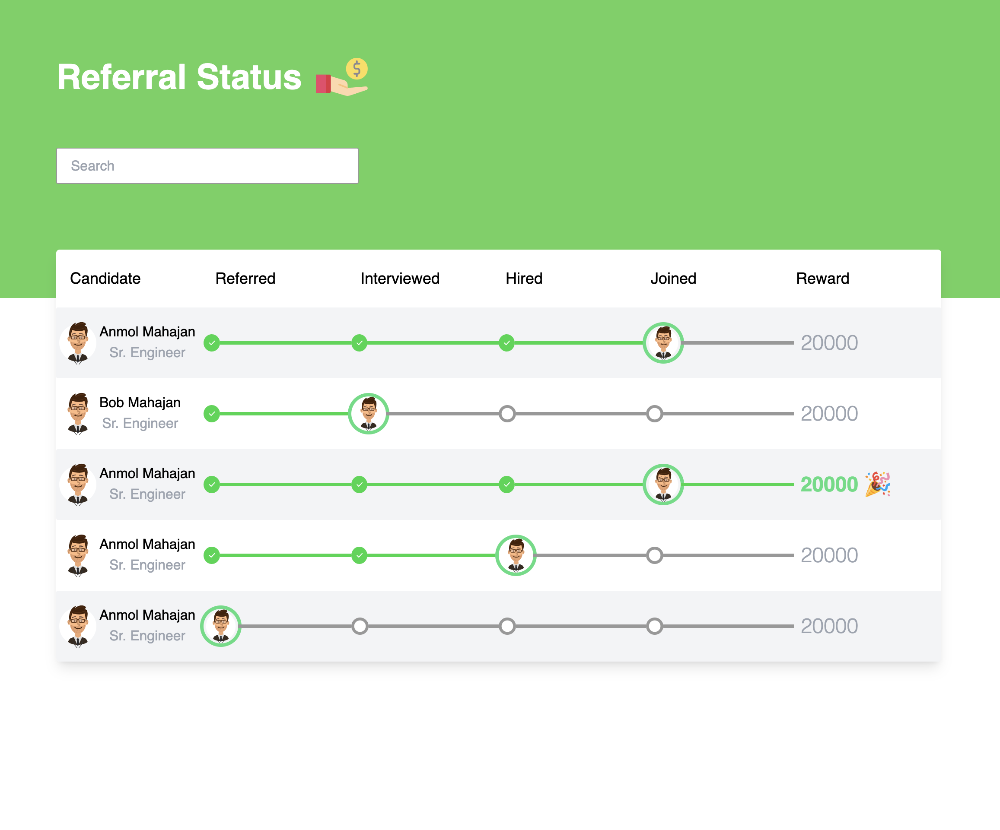
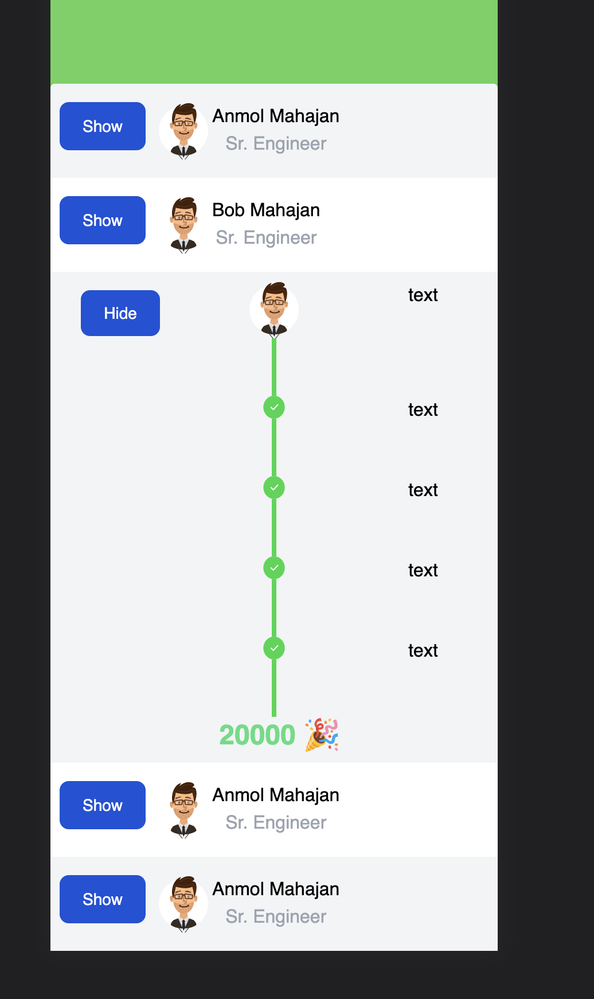

<!-- Improved compatibility of back to top link: See: https://github.com/othneildrew/Best-README-Template/pull/73 -->

<a name="readme-top"></a>

<!--
*** Thanks for checking out the Best-README-Template. If you have a suggestion
*** that would make this better, please fork the repo and create a pull request
*** or simply open an issue with the tag "enhancement".
*** Don't forget to give the project a star!
*** Thanks again! Now go create something AMAZING! :D
-->

<!-- PROJECT SHIELDS -->
<!--
*** I'm using markdown "reference style" links for readability.
*** Reference links are enclosed in brackets [ ] instead of parentheses ( ).
*** See the bottom of this document for the declaration of the reference variables
*** for contributors-url, forks-url, etc. This is an optional, concise syntax you may use.
*** https://www.markdownguide.org/basic-syntax/#reference-style-links
-->

[![Contributors][contributors-shield]][contributors-url]
[![Forks][forks-shield]][forks-url]
[![Stargazers][stars-shield]][stars-url]
[![Issues][issues-shield]][issues-url]
[![MIT License][license-shield]][license-url]
[![LinkedIn][linkedin-shield]][linkedin-url]

<!-- PROJECT LOGO -->
<br />
<div align="center">
  <a href="https://github.com/itachi47/suitable_ai_test">
    
  </a>
  <a href="https://github.com/itachi47/suitable_ai_test">
    
  </a>

<h3 align="center">React Test</h3>

  <p align="center">
    React assignemnt to develop a responsive web page.
    <br />
    <br />
    <a href="https://github.com/itachi47/suitable_ai_test">View Demo</a>
    ·
    <a href="https://github.com/itachi47/suitable_ai_test/issues">Report Bug</a>
    ·
    <a href="https://github.com/itachi47/suitable_ai_test/issues">Request Feature</a>
  </p>
</div>

<!-- TABLE OF CONTENTS -->
<details>
  <summary>Table of Contents</summary>
  <ol>
    <li>
      <a href="#about-the-project">About The Project</a>
      <ul>
        <li><a href="#built-with">Built With</a></li>
      </ul>
    </li>
    <li>
      <a href="#getting-started">Getting Started</a>
      <ul>
        <li><a href="#prerequisites">Prerequisites</a></li>
        <li><a href="#installation">Installation</a></li>
      </ul>
    </li>
    <li><a href="#usage">Usage</a></li>
    <!-- <li><a href="#roadmap">Roadmap</a></li> -->
    <li><a href="#contributing">Contributing</a></li>
    <li><a href="#license">License</a></li>
    <li><a href="#contact">Contact</a></li>
    <li><a href="#acknowledgments">Acknowledgments</a></li>
  </ol>
</details>

<!-- ABOUT THE PROJECT -->

## About The Project

This is a small project in series to learn smart contract development, this help to understand that how frontend interacts with the contract at the backend, using ethers and hardhat(as backend).

<p align="right">(<a href="#readme-top">back to top</a>)</p>

### Built With

- [![HTML5][html.js]][html-url]
- [![React][react.js]][react-url]
- [![tailwindcss][tailwind.js]][tailwind-url]

<p align="right">(<a href="#readme-top">back to top</a>)</p>

<!-- GETTING STARTED -->

## Getting Started

To get a local copy up and running follow these simple example steps.

### Prerequisites

This is an example of how to list things you need to use the software and how to install them.

- npm
  ```sh
  npm install npm@latest -g
  ```

### Installation

1. Clone the repo
   ```sh
   git clone https://github.com/itachi47/suitable_ai_test.git
   ```
2. Install the dependencies
   ```sh
   yarn
   ```
3. Run server
   ```sh
   yarn start
   ```

<p align="right">(<a href="#readme-top">back to top</a>)</p>

<!-- USAGE EXAMPLES -->

<!-- CONTRIBUTING -->

## Contributing

Contributions are what make the open source community such an amazing place to learn, inspire, and create. Any contributions you make are **greatly appreciated**.

If you have a suggestion that would make this better, please fork the repo and create a pull request. You can also simply open an issue with the tag "enhancement".
Don't forget to give the project a star! Thanks again!

1. Fork the Project
2. Create your Feature Branch (`git checkout -b feature/AmazingFeature`)
3. Commit your Changes (`git commit -m 'Add some AmazingFeature'`)
4. Push to the Branch (`git push origin feature/AmazingFeature`)
5. Open a Pull Request

<p align="right">(<a href="#readme-top">back to top</a>)</p>

<!-- LICENSE -->

## License

Distributed under the MIT License. See `LICENSE` for more information.

<p align="right">(<a href="#readme-top">back to top</a>)</p>

<!-- CONTACT -->

## Contact

Kuldeep Karhana - kkarhan47@gmail.com

Project Link: [https://github.com/itachi47/suitable_ai_test](https://github.com/itachi47/suitable_ai_test)

<p align="right">(<a href="#readme-top">back to top</a>)</p>

<!-- ACKNOWLEDGMENTS -->

## Acknowledgments

- [tailwindcss](https://www.freecodecamp.org/)
- [flowbite](https://flowbite.com)

<p align="right">(<a href="#readme-top">back to top</a>)</p>

<!-- MARKDOWN LINKS & IMAGES -->
<!-- https://www.markdownguide.org/basic-syntax/#reference-style-links -->

[contributors-shield]: https://img.shields.io/github/contributors/itachi47/suitable_ai_test.svg?style=for-the-badge
[contributors-url]: https://github.com/itachi47/suitable_ai_test/graphs/contributors
[forks-shield]: https://img.shields.io/github/forks/itachi47/suitable_ai_test.svg?style=for-the-badge
[forks-url]: https://github.com/itachi47/suitable_ai_test/network/members
[stars-shield]: https://img.shields.io/github/stars/itachi47/suitable_ai_test.svg?style=for-the-badge
[stars-url]: https://github.com/itachi47/suitable_ai_test/stargazers
[issues-shield]: https://img.shields.io/github/issues/itachi47/suitable_ai_test.svg?style=for-the-badge
[issues-url]: https://github.com/itachi47/suitable_ai_test/issues
[license-shield]: https://img.shields.io/github/license/itachi47/suitable_ai_test.svg?style=for-the-badge
[license-url]: https://github.com/itachi47/suitable_ai_test/blob/master/LICENSE.txt
[linkedin-shield]: https://img.shields.io/badge/-LinkedIn-black.svg?style=for-the-badge&logo=linkedin&colorB=555
[linkedin-url]: https://www.linkedin.com/in/kuldeep-singh-karhana-80835119a/
[product-screenshot]: images/screenshot.png
[react.js]: https://img.shields.io/badge/React-20232A?style=for-the-badge&logo=react&logoColor=61DAFB
[react-url]: https://reactjs.org/
[html.js]: https://img.shields.io/badge/html5-%23E34F26.svg?style=for-the-badge&logo=html5&logoColor=white
[html-url]: https://developer.mozilla.org/en-US/docs/Glossary/HTML5
[react.js]: https://img.shields.io/badge/-ReactJs-61DAFB?logo=react&logoColor=white&style=for-the-badge
[react-url]: https://reactjs.org/
[tailwind.js]: https://img.shields.io/badge/tailwindcss-%2338B2AC.svg?style=for-the-badge&logo=tailwind-css&logoColor=white
[tailwind-url]: https://tailwindcss.com/
